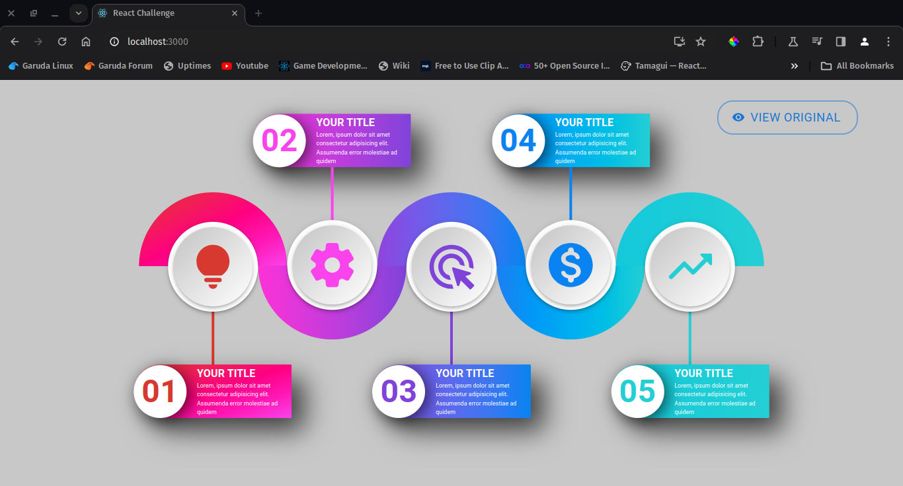

# React Challenge Test

## Description

This repository contains a React challenge test. The challenge aims to showcase skills in React development.

## Getting Started

To run the application locally, follow these steps:

1. Ensure you've navigated into the project's directory:

   ```
   cd react-challenge
   ```

2. Install the required packages using npm:

   ```
   npm install
   ```

3. Start the React website:
   ```
   npm start
   ```

## Demo

Here's a snapshot of the website:


## Technologies Used

- React
- npm
